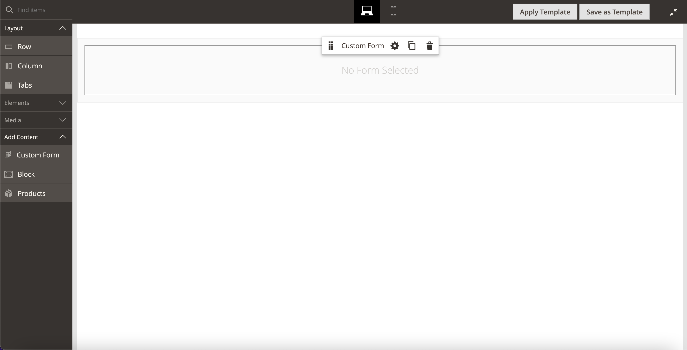
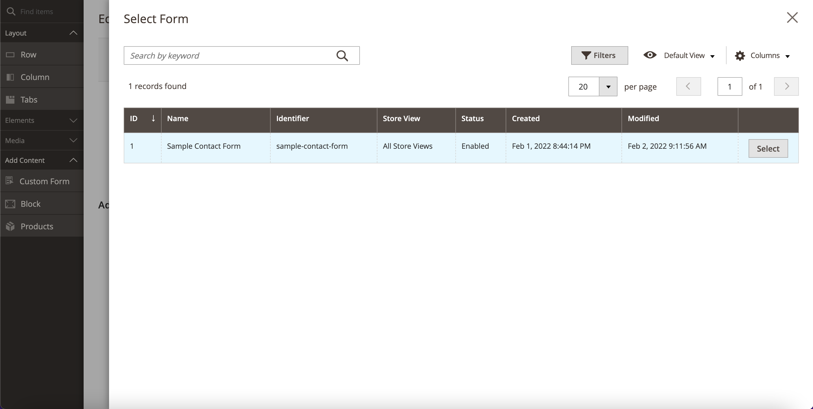
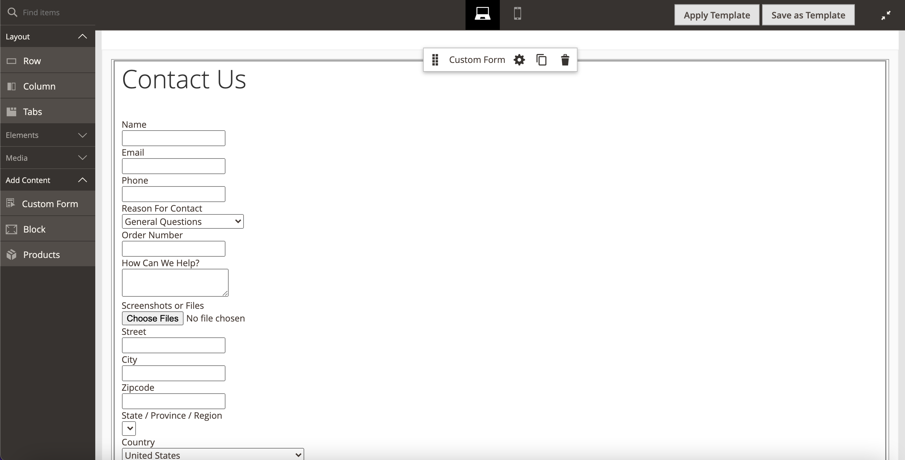

# Magento 2 Custom Forms Page Builder Component

## Module Overview
This Magento 2 module provides a page builder component to handle rendering custom forms.

**This is only a page builder integration, this module does not provide form building functionality.**

The content type is available under the **Add Content** section in Pagebuilder.

The content type provides a simple form selection listing to allow you to select a form
from any of your existing forms.

Once selected you'll see the rendered form in the Pagebuilder stage.  

